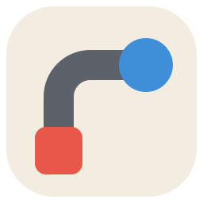
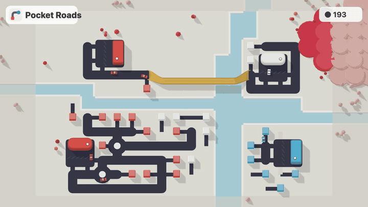

<p align="center">
  
</p>

<h1 align="center">Pocket Roads</h1>

<p align="center"><b>Draw roads. Keep the city moving.</b><br>
A small, calm city traffic puzzle that runs in your browser.</p>

<p align="center">
  
</p>

<p align="center"><b><a href="https://pocket-roads.vercel.app/">▶ Play in your browser</a></b> · <a href="docs/gameplay.mp4">Watch the full clip with sound (MP4)</a></p>

---

## How to play

Houses and destinations pop up around the map, each with a colour. Cars from a house drive to a destination of the **same colour**, pick up a pin and head home. Your job is to connect them with roads before demand piles up.

- If a destination gets more pins than it can hold, a **red ring** starts filling around it. When the ring closes, the game is over.
- Every **week** you get more road tiles and pick one of two upgrades.
- Every few weeks the **map grows** and new colours arrive.
- Roads are limited, so plan routes and fight traffic jams.

### Tools

| Tool | What it does |
|---|---|
| **Road** | Drag to draw, in 8 directions. Right-drag to erase; erased tiles are refunded. |
| **Bridge / Tunnel** | Spent automatically when a road crosses water or a mountain. |
| **Roundabout** | Click a junction. Several cars can use it at once, as long as their paths don't cross. |
| **Traffic light** | Click a junction. It gives green to whichever direction has cars waiting. |
| **Motorway** | Drag between two roads. A fast, raised golden deck that cars join only at its ends. |

### Controls

| Input | Action |
|---|---|
| Left-drag | Draw a road |
| Drag out of a house | Turn the house to face that way |
| Right-drag | Erase |
| Right-click a toolbar tool | Remove placed tools of that kind |
| Scroll | Zoom |
| Middle-drag / Space + drag | Pan |
| `P` / `1` / `2` | Pause / normal speed / fast |
| `H` | Replay the tutorial |
| `L` | Switch day / night |
| `Esc` | Back to the road tool |

## Features

- Lane-based traffic: cars queue, keep their distance, give way at junctions, and can gridlock.
- Roundabouts where cars merge, circle the island and exit smoothly.
- Traffic lights that respond to waiting cars.
- Golden glass motorways that branch off the road on slip ramps.
- Parking lots that you can enter from three sides.
- Generated maps with rivers, lakes and mountains, built from a seed (`?seed=123`).
- A colour theme per city (Sunny, Snowy, Meadow, Blossom), plus a day/night switch on the title screen or with `L`.
- Generative ambient music and sound effects, all synthesized in the browser. No audio files.
- A first-play tutorial, a local high score, and a title screen.

## Run it locally

You need Node.js 18 or newer.

```bash
npm install
```

```bash
npm run dev
```

Then open http://localhost:5173.

```bash
npm test
```

```bash
npm run build
```

## How it's built

Vite + TypeScript + [Three.js](https://threejs.org/), with no game engine.

```
src/
  sim/      pure TypeScript game logic: fixed 60 Hz steps, seeded RNG, no rendering
            map generation, road network, pathfinding, traffic, buildings, weeks
  render/   Three.js scene: terrain, roads, buildings, cars (instanced meshes)
  input/    camera controls and the road / tool drawing
  ui/       HUD, toolbar, menu, tutorial, upgrade picker, game over
  audio/    procedural music and sound effects (Web Audio)
```

The simulation doesn't depend on the renderer, so the rules are covered by plain unit tests (`vitest`). Those tests include gridlock checks, and checks that cars on roundabouts never overlap.

## Credits

Made by Nima, built with help from Claude.

Pocket Roads is an independent fan project inspired by the gameplay of *Mini Motorways* by Dinosaur Polo Club. It isn't affiliated with or endorsed by them, and uses no assets from their game.
